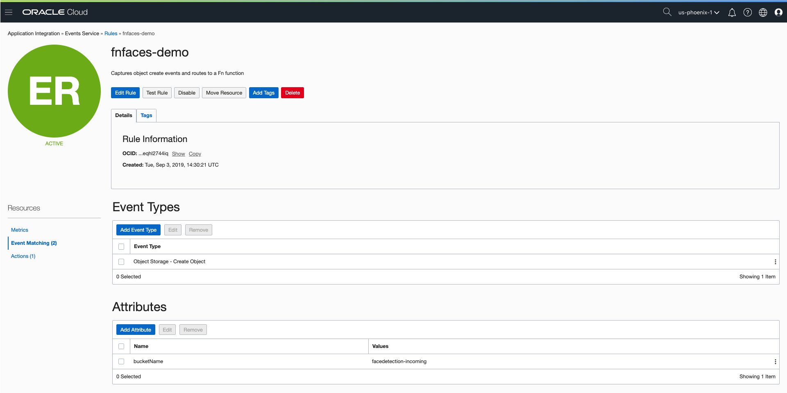
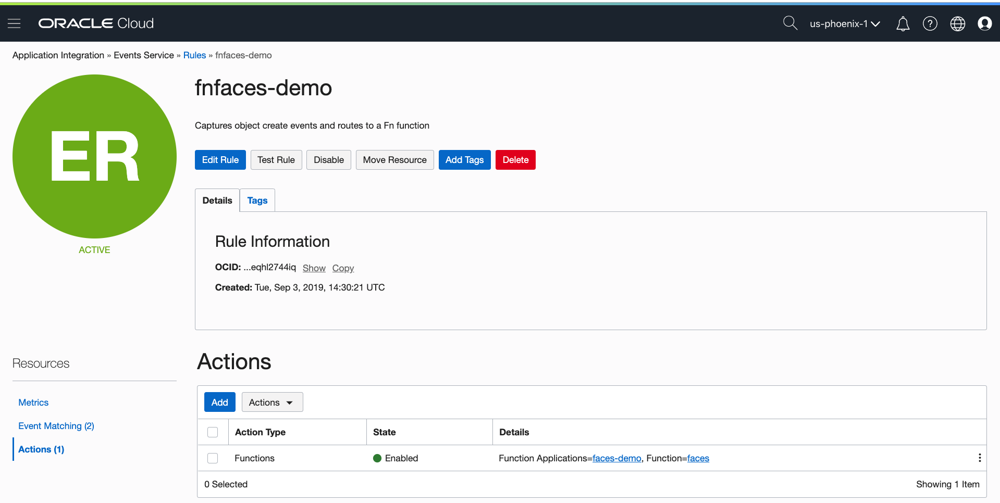
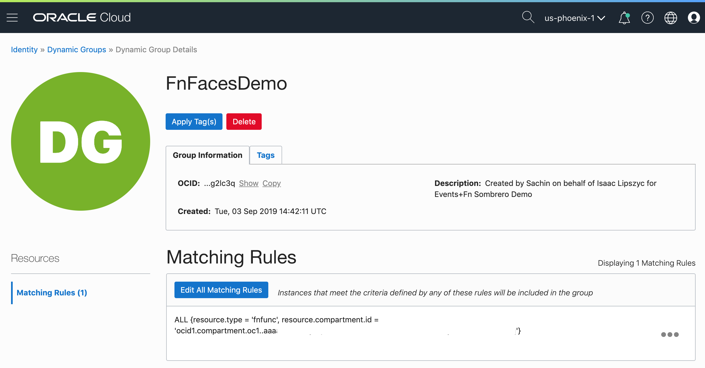
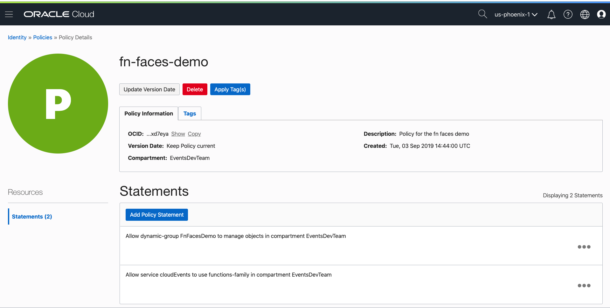
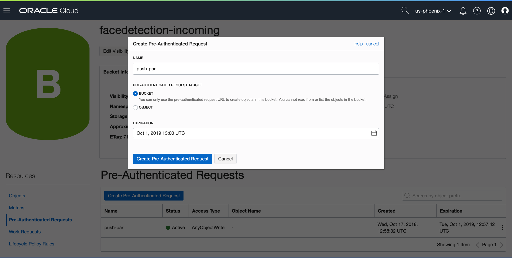

# Functions Face recognition demo

This is a demo of Oracle Functions integrated with OCI Events in the Oracle Cloud Object Store.

##  Talking points

This is a demo that demonstrates a completely serverless use case integrating a browser-based app (captures images, and shows results) OCI Object storage (stores incoming images and results), OCI Events (triggers function calls when new objects arrive) and OCI Functions (transforms images using face recognition and uploads results back to object storage)


Key things to highlight:

* OCI Events and Functions provide a powerful means for customers to both integrate existing software (including legacy and new build cloud software) and other OCI services
* The demo is completely serverless - there is no fixed infrastructure and the service will scale up on demand and cost you nothing when it's not running
* The [function](src/main/java/com/example/fn/FacesFunctions.java) is built as a standard docker image (familiar tooling) and uses the  open source functions function development kit (FDK) to simplify the developer experience
* The development kit supports local testing of code prior to deployment - see [the test](src/test/java/com/example/fn/FacesFunctionsTest.java)
* As a developer you get to focus on the code, the body of the function is plain old java, it's easy to read and code and can take advantage of the whole java stack , but we also don't get in your way when you want to do more powerful things -  in this case we use an  using a JNI library (openCV) which we re-bundle and install as part of the function build
* The Build is done using a plain old [Dockerfile](Dockerfile)
* Events are sent to the function using the  open [cloud-events](https://cloudevents.io/) protocol in JSON this makes handling events easy and standards-based as well as enabling inter-cloud communication for customers applications.
* When the function is running it's connected to a customer-owned private network  - in this case we only use OCI resources but you could also attach to private services you run on your VCN like databases or rest APIs.


## Demo notes

The face recognition requires a full-face image at a reasonable resolution - make sure you stand well back from the camera.
Images are uploaded from the cloud and may be publicly accessible - they use random, hard to guess IDs by default.

Example walk through - this assumes you already have an account with access to functions and events,

It is recommended to set up an OCI account with only read/write access to the appropriate buckets.

The input bucket "facedetection-incoming", output bucket "facedetection-results" and "ui" bucket must also have already been created in your compartment. 

Create the function:
```
fn create app faces-demo --annotation 'oracle.com/oci/subnetIds=["ocid1.subnet.oc1.phx.aaaaaaa...","ocid1.subnet.oc1.phx.aaaaaaaab...","ocid1.subnet.oc1.phx.aaaaaaaap..."]'
fn config app faces-demo OCI_REGION us-phoenix-1
fn config app faces-demo OUTPUT_BUCKET "facedetection-results"
```

Deploy the function:
```
fn -v deploy --app faces-demo
```
These next few steps can be done through the OCI console.

Set up the events rules:




Create the dynamic group: 


Dynamic Group name: 
```
FnFacesDemo
```
The matching rule used:
```
ALL {resource.type = 'fnfunc', resource.compartment.id = 'ocid1.compartment.oc1..aaa...vveq'}
```

Create the policies:


Policy statements used: 
```
Allow dynamic-group FnFacesDemo to manage objects in compartment compartment-name

Allow service cloudEvents to use functions-family in compartment compartment-name
```

Create a Pre-Authenticated Request URL for the facedetection-incoming bucket:


And edit the visibility of output bucket facedetection-results to public.

Within index.html set `const sombreroSourceBucketURLBase ` to the Pre-Authenticated Request URL, and, `const sombreroOutputURLBase` to the public address.
The public address will be in the form of: 
```

"https://objectstorage.us-phoenix-1.oraclecloud.com/n/<namespace>/b/<bucket-name>/o/";
```


Open the UI:
```
 open dumbui/index.html
```

Update the browser url to add `?sombrero=true` to the end

## Deploying the demo

The demo UI is hosted in a public Object Storage bucket. If you append
*?debug* to the end of the URL it will show some debugging information while
it's running.

[Exciting Sombrero demo](https://objectstorage.us-phoenix-1.oraclecloud.com/n/ocimiddleware/b/ui/o/index.html).

We also have a short URL [http://bit.ly/openworld-cloud-events-function](http://bit.ly/openworld-cloud-events-function) and a QR Code to take people directly to the demo page in Object Storage.


To push the demo page to the "ui" bucket:
```

oci os object put -ns tenant-name -bn ui --name index.html --file dumbui/index.html --content-type "text/html" --force --profile $PROFILE
```
Or you can directly upload the index.html file to the bucket using the OCI console.
## Stolen Resources

Spinner was #2 from this site, http://tobiasahlin.com/spinkit/
